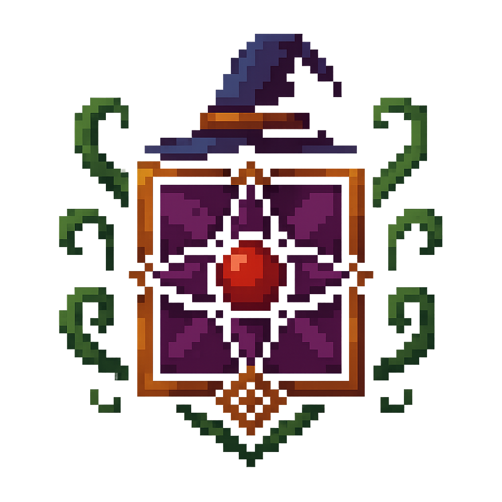

  <h1 class="faccion-title">Brujas de la Rosa Negra</h1>

  <!-- 1. Imagen centrada -->
  

    
  

  <!-- 2. Metadatos en 2 columnas -->
  

    

      <strong>Fundación</strong>
      300&nbsp;d.E.
    

    

      <strong>Caída</strong>
      1356 d.E.
    

    

      <strong>Alineamiento</strong>
      Magos caídos
    

    

      <strong>Propósito</strong>
      Transformación vital y prolongación de la vida mediante rituales de sangre.
    

  

  <!-- 3. Sección Historia -->
  

    <h2>Historia</h2>
    

      Gobernadas por matriarcas, tejían destinos con pétalos carmesí y hojas ceremoniales. Sus festejos
      nocturnos atraían a nobles y mercenarios.
    

    

      Tras el Incendio de Roenhal (<strong>1356&nbsp;d.E.</strong>), se replegaron a cámaras subterráneas,
      donde perfeccionan maleficios de metamorfosis y alimentan rumores de nigromancia. Aún hoy, la Rosa
      Negra emerge en mitos de vampiros y señoras del subsuelo.
    

  

