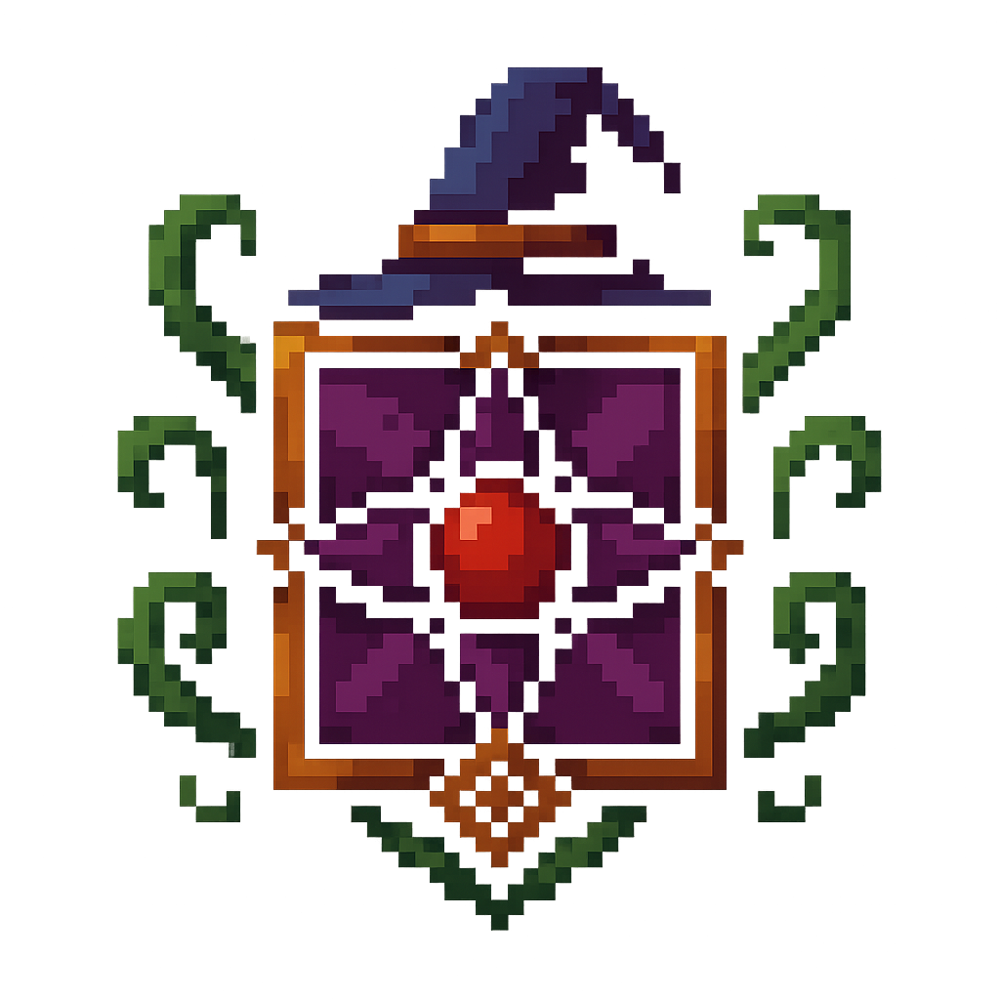
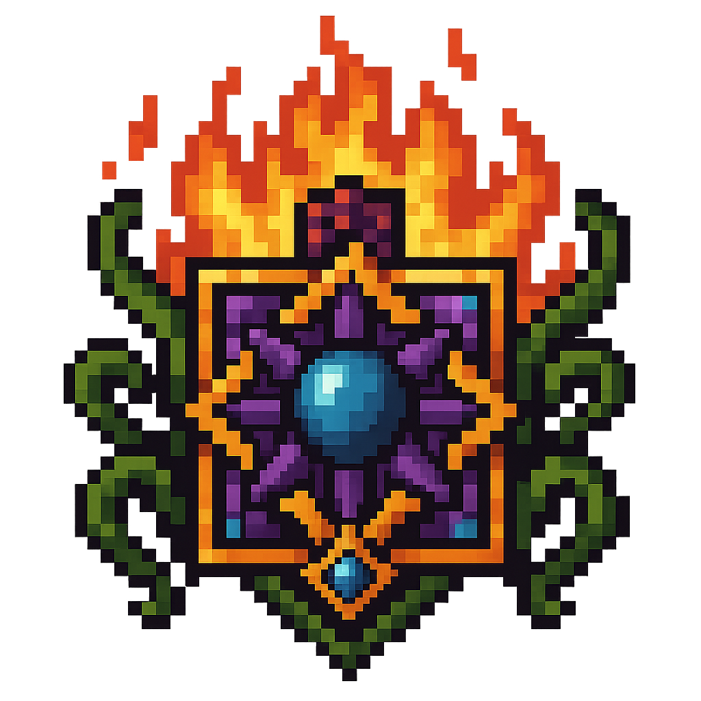

<h2>Subfacciones de los Magos</h2>

  

    
    

      Curación y defensa de poblados usando magia pura y sanadora.
    

    <a href="../OrdenDeLaTorreBlanca" class="subfaccion-btn">Orden la Torre Blanca</a>
  

  

    
    

      Registrar y difundir todo conocimiento arcano sin fines bélicos.
    

    <a href="../CirculoErudito" class="subfaccion-btn">Círculo Erudito</a>
  

  

    
    

      Caza y exterminio de criaturas mágicas fuera de control.
    

    <a href="../BrujosDeDrakenhart" class="subfaccion-btn">Brujos de Drakenhart</a>
  

  

    
    

      Transformación vital y prolongación de la vida mediante rituales de sangre.
    

    <a href="../BrujasDeLaRosaNegra" class="subfaccion-btn">Brujas de la Rosa Negra</a>
  

  

    
    

      Alquimia viviente: creación de plagas selectivas y protecciones biológicas.
    

    <a href="../ClanesDeSangreVerde" class="subfaccion-btn">Clanes de Sangre Verde</a>
  

  

    
    

      Explorar energías infernales y forjar portales de fuego eterno.
    

    <a href="../ArcanistasDelNether" class="subfaccion-btn">Arcanistas del Nether</a>
  

  

    
    

      Guardar sellos y neutralizar filtraciones del Vacío.
    

    <a href="../TejedoresDelVacio" class="subfaccion-btn">Tejedores del Vacío</a>
  

