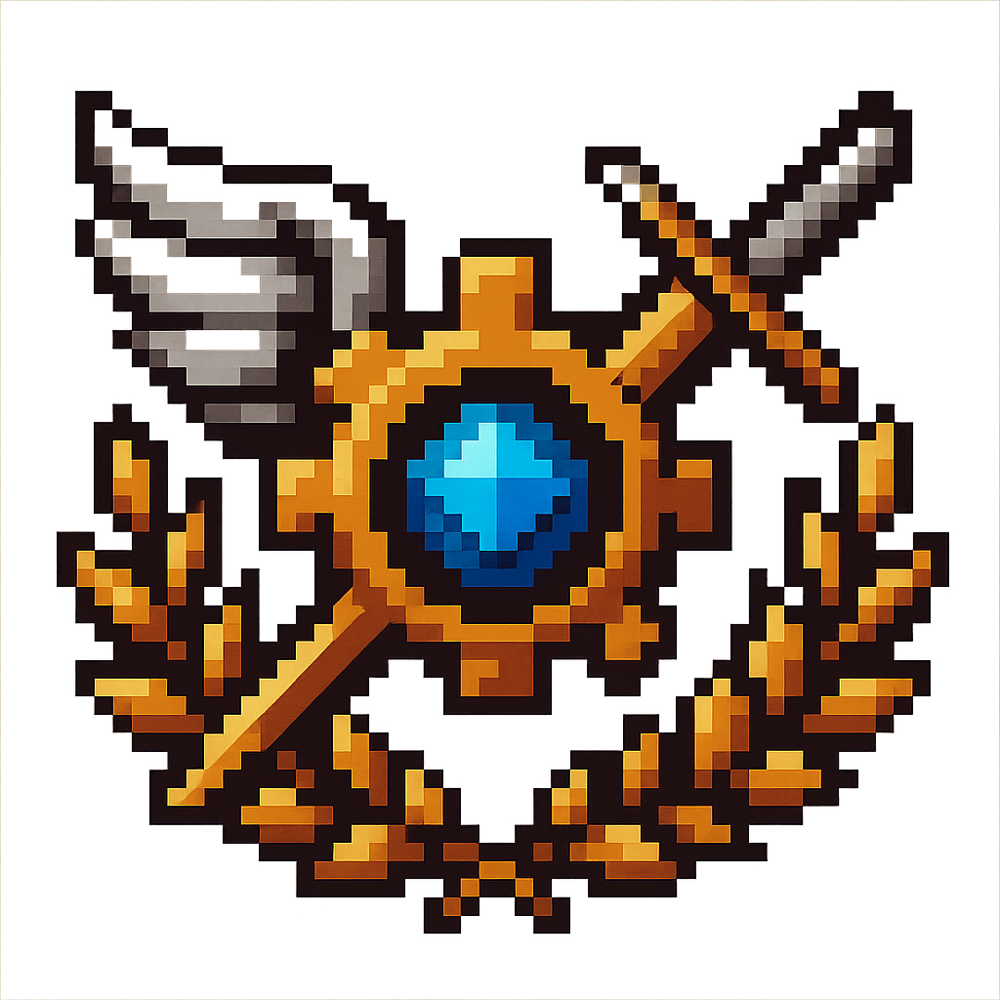

  <h1 class="faccion-title">Escuela Superior de Ingeniería Vanguardium</h1>

  <!-- 1. Imagen centrada -->
  

    
  

  <!-- 2. Metadatos en 2 columnas -->
  

    

      <strong>Fundación</strong>
      1371&nbsp;d.E.
    

    

      <strong>Caída</strong>
      Activo
    

    

      <strong>Influencia en Asamblea</strong>
      20&nbsp;%
    

    

      <strong>Perfil</strong>
      
        Centro neurálgico del CUP: dirigen la logística, innovan en artillería antimagia y negocian contratos con gremios industriales.
      
    

  

  <!-- 3. Sección Historia -->
  

    <h2>Historia</h2>

    <h3>Origen</h3>
    

      Creada en 1371&nbsp;d.E., centralizó todos los talleres dispersos de la Coalición bajo un mando único.
    

    <h3>Hitos clave</h3>
    <ul>
      <li><strong>1372&nbsp;d.E.</strong>: Presentación del “Lanzador de Kruge”.</li>
      <li><strong>1374&nbsp;d.E.</strong>: Finaliza la Red de Túneles Blindados fronterizos.</li>
    </ul>

    <h3>Más allá de sus hitos</h3>
    <ul>
      <li>Diseñaron el primer drone de reconocimiento (1375&nbsp;d.E.) capaz de detectar pozos de esencia residual.</li>
      <li>En 1382&nbsp;d.E. empezaron a investigar “balística antimagia” para optimizar proyectiles explosivos.</li>
      <li>Hoy es la gran urdimbre técnica de la Coalición y principal voz en la Asamblea para decidir gasto bélico.</li>
    </ul>
  

