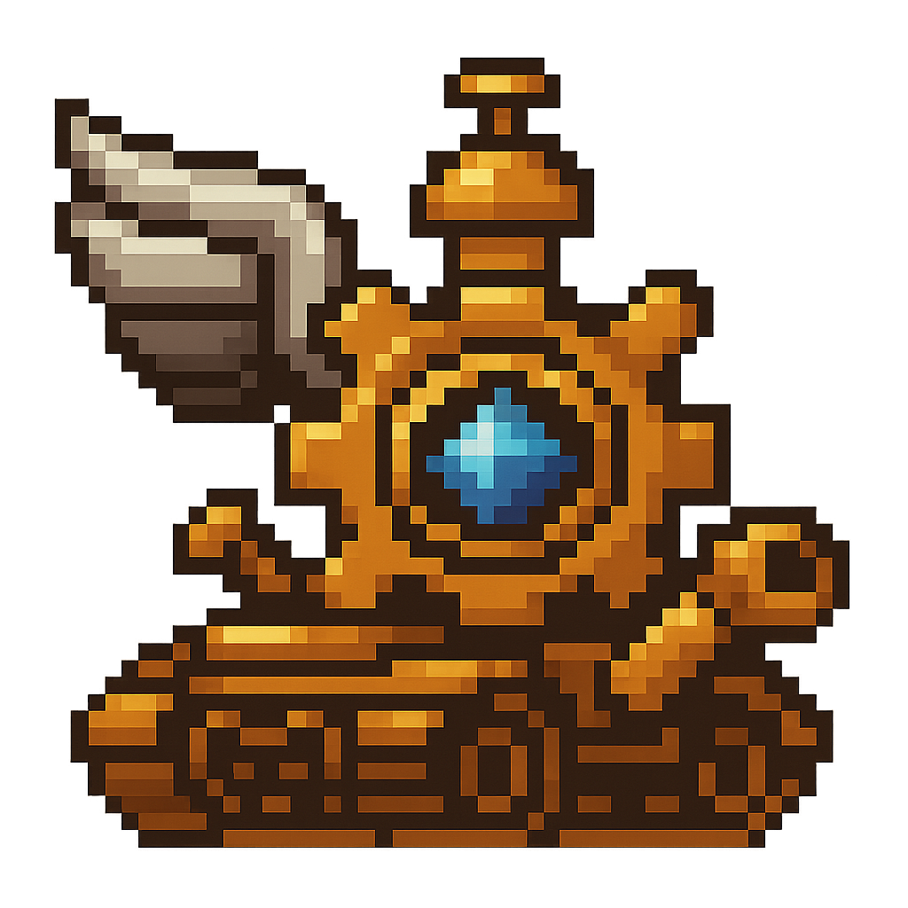
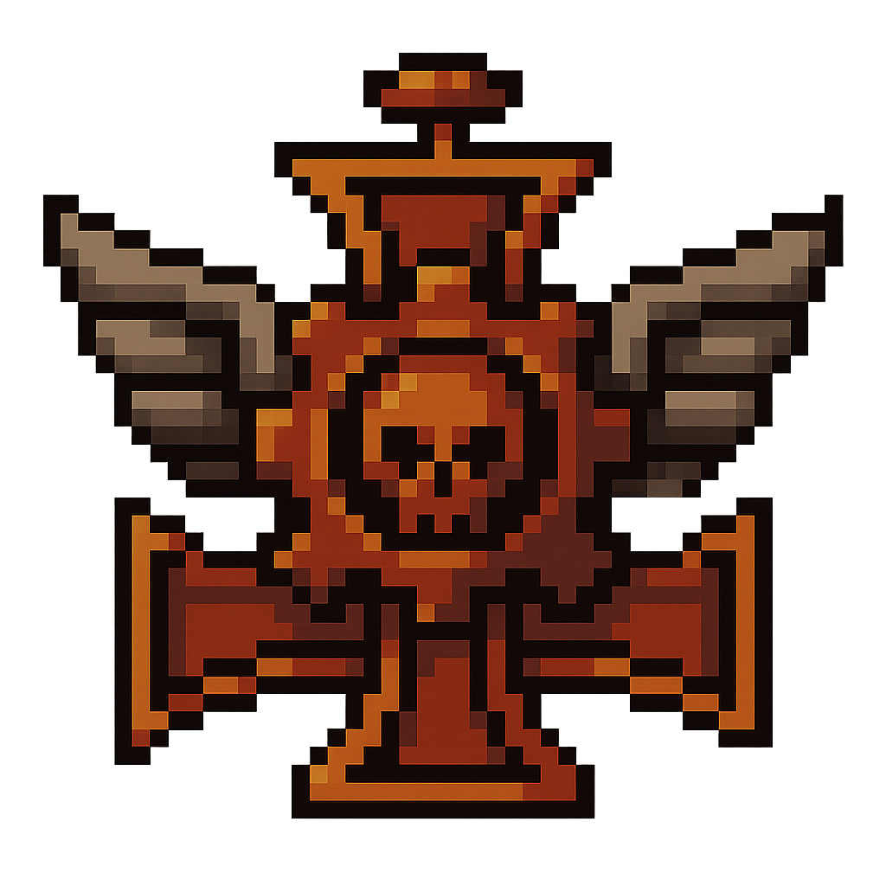
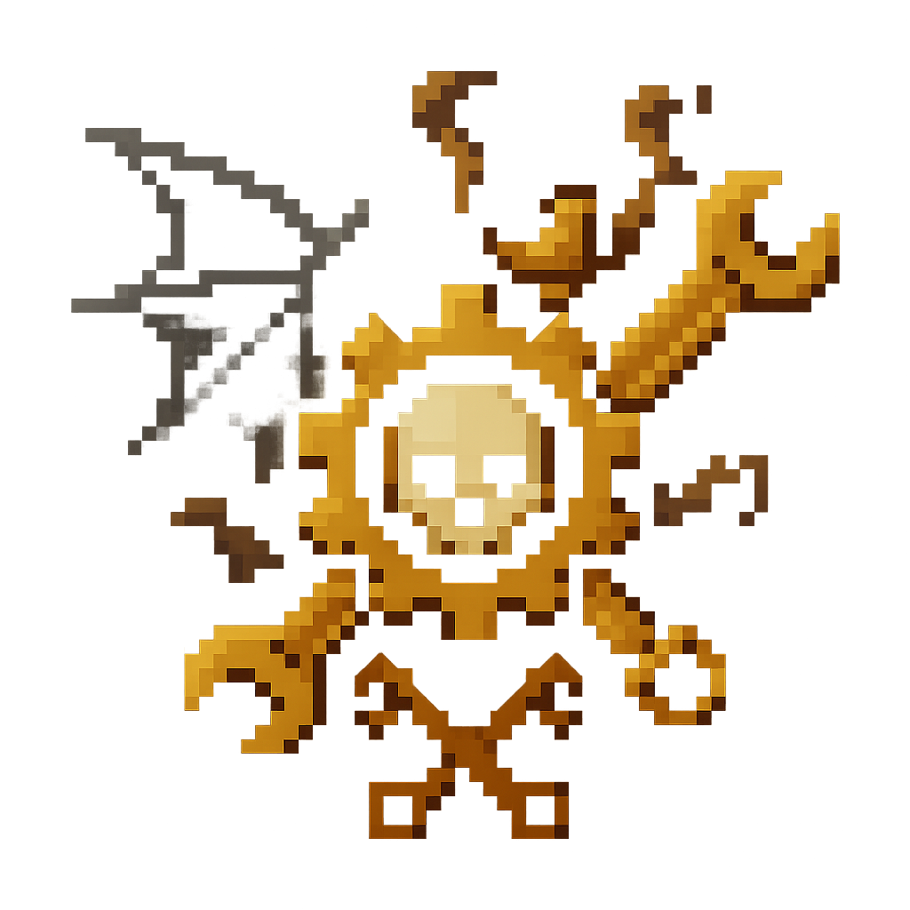
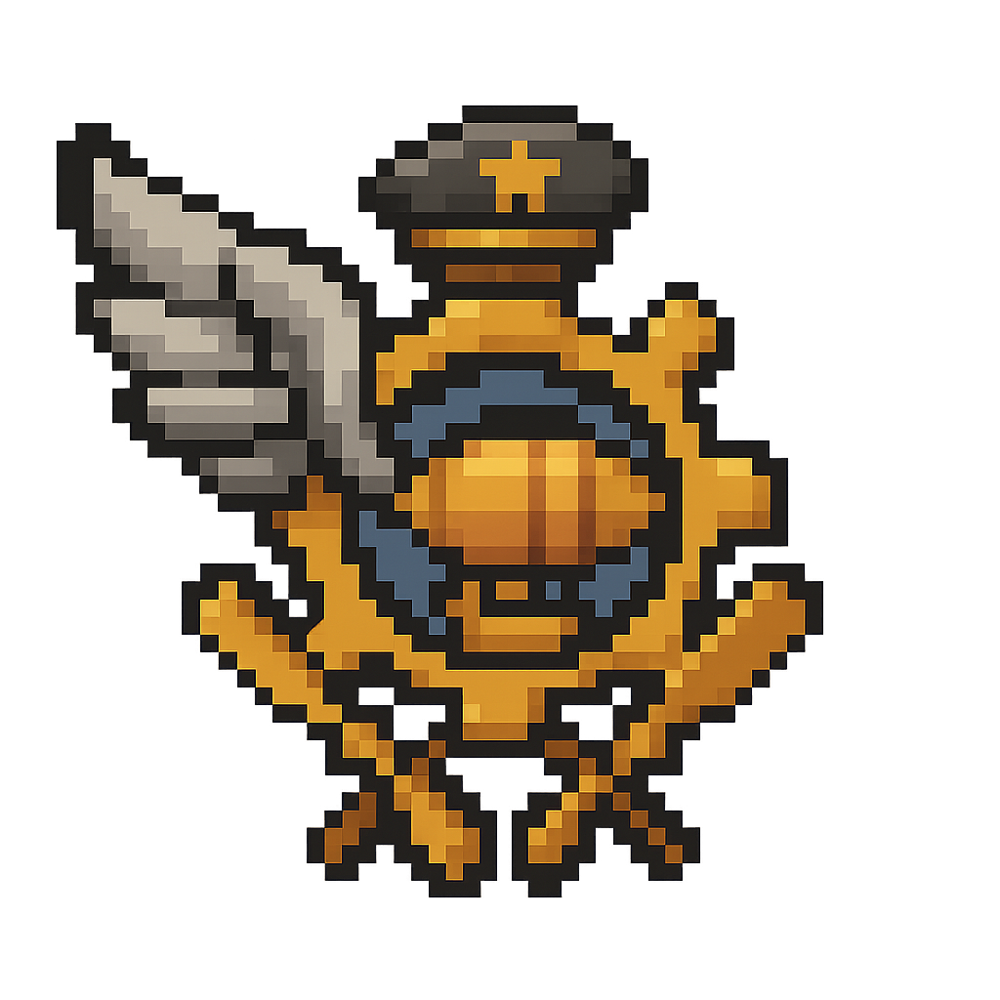
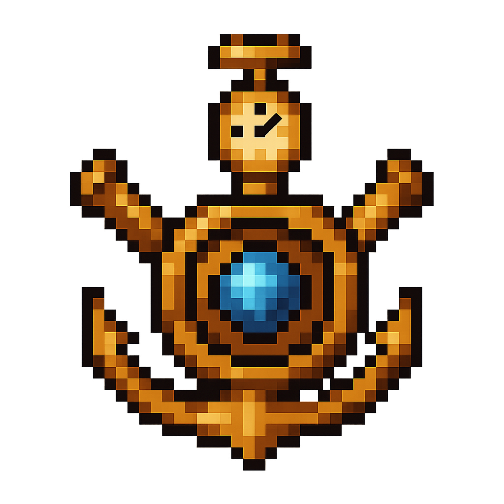
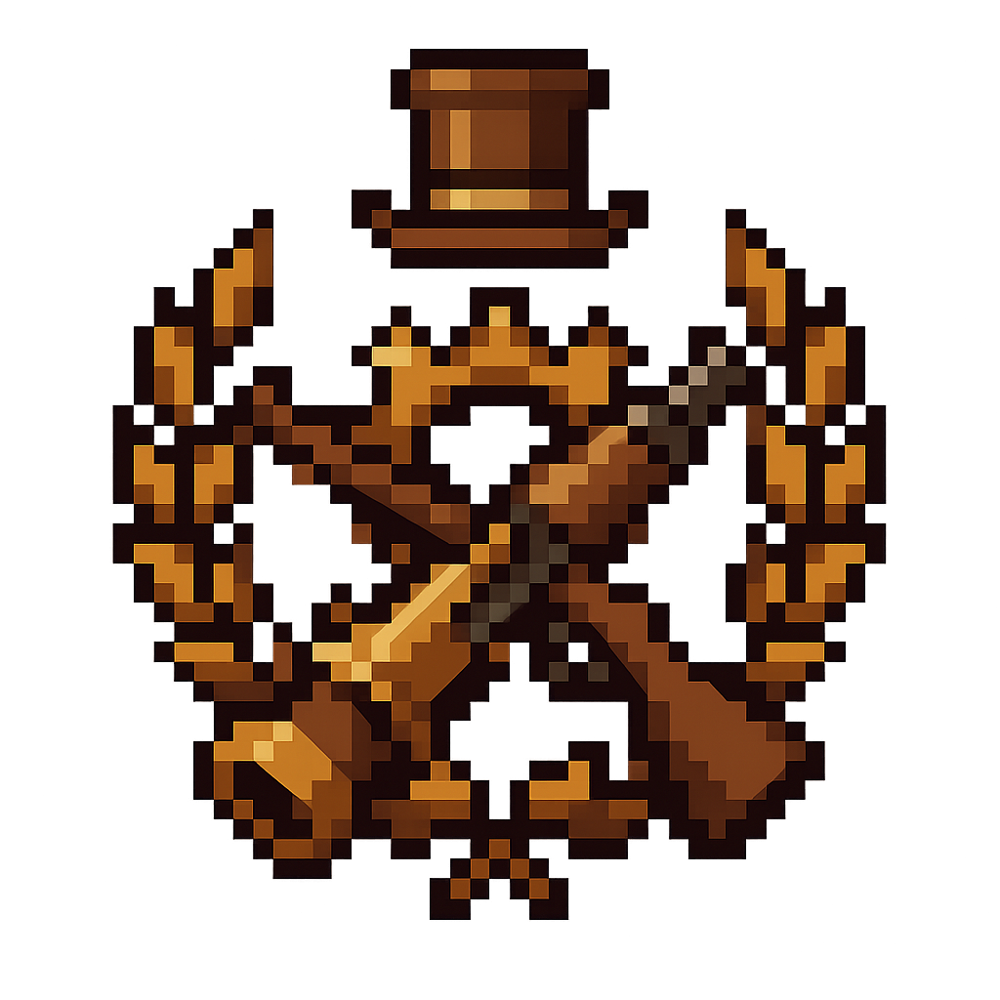

<h2>Subfacciones de la Coalición Tecnológica</h2>

  

    
    

      Nace junto a Alas Ícaro como columna de asalto blindado. Sus tanques rompemuros abrieron líneas fortificadas decisivas.
    

    <a href="../DivisionAcorazadaGoliat" class="subfaccion-btn">División Acorazada Goliat</a>
  

  

    
    

      Veteranos curtidos en la guerra, inspirados en ideologías puristas y tácticas despiadadas.
    

    <a href="../LegionDeLasCrucesRojas" class="subfaccion-btn">Legión de las Cruces Rojas</a>
  

  

    
    

      Unidad veterana formada por y para la guerra. Reclutó pilotos fanáticos de maniobras suicidas; pronto ganaron fama de terror aéreo sangriento.
    

    <a href="../AlasIcaro" class="subfaccion-btn">Alas Ícaro</a>
  

  

    
    

      Coordina la producción de armas de asedio, fortificaciones y artillería disruptora desde 1371 d.E.
    

    <a href="../EscuelaSuperiorDeIngenieriaVanguardium" class="subfaccion-btn">Escuela Superior de Ingeniería Vanguardium</a>
  

 
  

    
    

      Escuadrones de “vuelo limpio” y bombardeos quirúrgicos fundados por desertores de Alas Ícaro.
    

    <a href="../AcademiadeAviacionAquila" class="subfaccion-btn">Academia de Aviación Aquila</a>
  

   

    
    

      Armada diseñadas para bloquear costas mágicas y apoyar desembarcos anfibios con cañones de asedio.
    

    <a href="../ArmadaNavalColossus" class="subfaccion-btn">Armada Naval Colossus</a>
  

  

    
    

      Reconstruye ciudades y regula la producción masiva de armamento y maquinaria pesada desde 1394 d.E.
    

    <a href="../SindicatoIndustrialKronnos" class="subfaccion-btn">Sindicato Industrial Kronnos</a>
  

