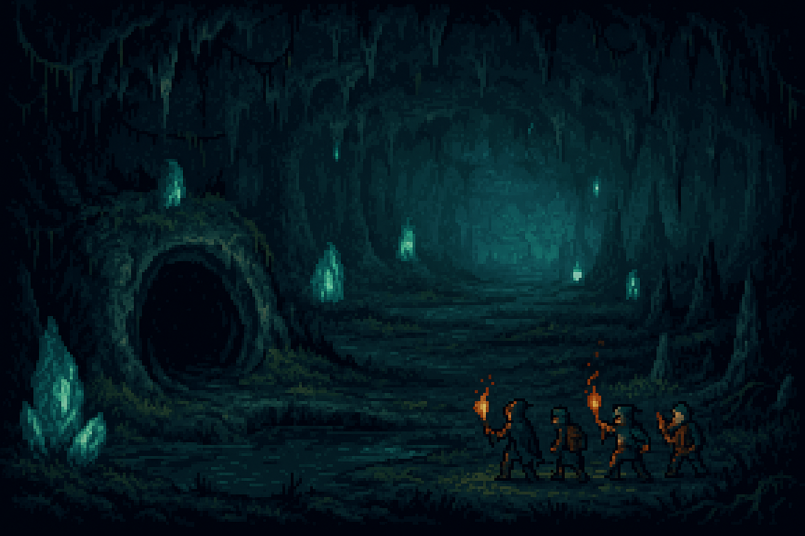

<!-- eras.md -->

<section id="era-dormida">
  <h2 style="border-left: 4px solid #78909c; padding-left: 0.5em; color: #455a64; font-size: 1.5em;">
    🪨 ERA DORMIDA (Pre-magia)
  </h2>

  
  

  <blockquote style="margin: 1em 0; padding: 0.75em 1em; background: #212425; border-left: 4px solid #78909c; font-style: italic;">
    En la quietud del subsuelo yacía un poder latente: la Esencia dormida, ignorada por completo por la humanidad.
  </blockquote>
  

    

      Los pozos se encontraban profundamente ocultos bajo tierra. Fue durante una expedición minera en busca de diamantes y minerales raros cuando, por accidente, se encontraron los primeros pozos, en cuyo interior crecían extraños Cristales arcanos deformes.
    

    

      Al intentar extraer y fragmentar estos cristales, una potente onda de partículas de Esencia arcana recorrió vertiginosamente todas las cuevas, extendiéndose rápidamente hacia el mundo exterior, recorriéndolo y alterándolo para siempre.
    

    

      Algo oscuro surgió al fragmentarse los cristales; una fuerza intangible atrapó sus almas en un vacío espectral, dejando atrás cuerpos vacíos que aún vagan sin descanso por las profundidades. Desde entonces, jamás se supo nada más de aquella primera expedición, y todos los que posteriormente descendían en busca de respuestas o riquezas también desaparecían sin dejar rastro.
    

  

</section>
