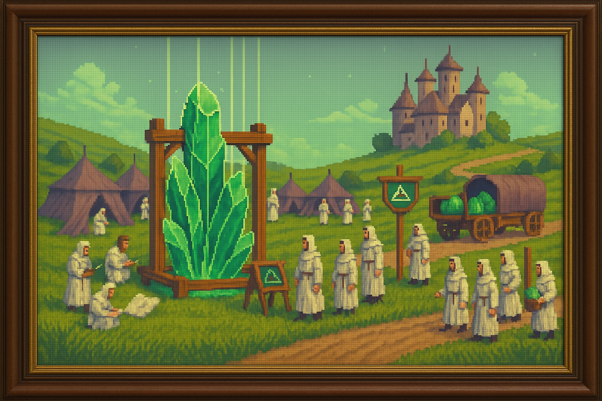

<section id="despertar-expansion">
  <h3 style="
    border-left: 4px solid #7e57c2;
    padding-left: 0.5em;
    color: #7e57c2;
    font-size: 1.5em;
    margin-top: 1.5em;
  ">
    🟣 El Despertar y la Expansión
  </h3>
  
  
  <blockquote style="
    margin: 1em 0;
    padding: 0.75em 1em;
    background:rgb(46, 32, 71);
    border-left: 4px solid #7e57c2;
    font-style: italic;
  ">
    Tras la liberación accidental de la Esencia arcana, brotaron nuevos Pozos que distribuyeron magia por el mundo, dando paso a visionarios que moldearon la realidad y presagiando futuras corrupciones.
  </blockquote>
  

    

      Al final, tras liberar accidentalmente la Esencia arcana alrededor del mundo, comenzaron a brotar más Pozos de esencia por todas partes, emergiendo de la tierra con Cristales arcanos que servían como catalizadores, distribuyendo la magia.
    

    

      Durante siglos se utilizó la Esencia arcana para moldear el mundo al antojo de visionarios e idealistas. Inicialmente, muchas personas se mostraron reacias al uso de esta nueva fuerza, ya que no todos tenían la capacidad de manipularla. Entre los que sí podían, existían grandes diferencias; algunos poseían gran talento, mientras otros apenas podían tocar la superficie de su poder.
    

    

      Pero con el paso del tiempo, la cantidad de personas capaces de manipular la esencia aumentó significativamente. Con este incremento también aparecieron individuos que empleaban la magia con fines egoístas o destructivos, llevando inevitablemente a la corrupción y deterioro de la Esencia arcana.
    

  

</section>
