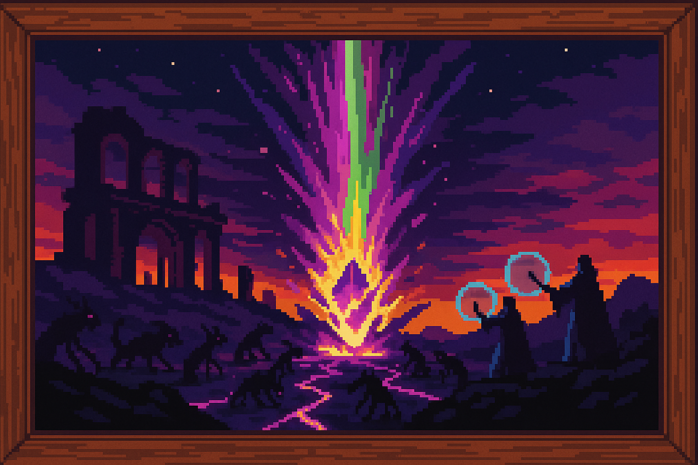

<section id="primera-ruptura">
  <h3 style="
    border-left: 4px solid #d32f2f;
    padding-left: 0.5em;
    color: #d32f2f;
    font-size: 1.5em;
    margin-top: 1.5em;
  ">
    💥 PRIMERA RUPTURA
  </h3>
  
  
  <blockquote style="
    margin: 1em 0;
    padding: 0.75em 1em;
    background:hsl(0, 63.50%, 26.90%);
    border-left: 4px solid #d32f2f;
    font-style: italic;
  ">
    El abuso de los Cristales arcanos alcanzó un punto de no retorno, fragmentándose y desatando una Esencia salvaje que sumió al mundo en noches perpetuas, plagas desconocidas y terror insondable.
  </blockquote>
  

    

      Con el paso del tiempo, algunos magos comenzaron a hacer un uso indebido de los Cristales arcanos, buscando nuevas formas de poder y conocimiento prohibido. Poco a poco, estos cristales empezaron a mostrar señales de corrupción: cambiaron lentamente su color hacia tonos oscuros y opacos, aparecieron grietas luminosas en sus superficies, y emitían murmullos inquietantes que afectaban a quienes permanecían cerca demasiado tiempo.
    

    

      Esta corrupción avanzó hasta llegar a un punto de no retorno, cuando algunos de estos cristales, tras ser sometidos a un uso forzado constante, acabaron fragmentándose violentamente. Al romperse, emitieron ondas devastadoras que liberaron una Esencia arcana pura, en un estado completamente salvaje e imposible de utilizar.
    

    

      Con la liberación de esta esencia salvaje, empezaron a ocurrir sucesos extraordinarios y aterradores por todo el mundo. Las noches dejaron de durar solo horas y se prolongaron por días enteros, sumergiendo grandes regiones en la oscuridad perpetua. Surgieron plagas extrañas que arrasaban cosechas enteras en minutos, y criaturas monstruosas nunca antes vistas comenzaron a emerger desde lo más profundo de las sombras, acechando pueblos y ciudades enteras.
    

    

      Mientras todo esto sucedía, algunos magos encargados inicialmente de contener la corrupción vieron en esta esencia salvaje un potencial inmenso y comenzaron a investigar cómo podrían manipularla en beneficio propio. Otros, en cambio, intentaron desesperadamente reparar el daño ocasionado por la corrupción y restablecer el equilibrio.
    

    

      Finalmente, tras arduos esfuerzos, se logró manipular esta esencia pura, aunque la energía resultante era considerablemente más oscura y profunda de lo que nadie podía comprender plenamente. Este poder superaba cualquier límite conocido, lo que provocó tensiones y rivalidades entre los propios magos. Muchos, seducidos por la posibilidad de dominar aquella energía oscura, comenzaron a enfrentarse entre ellos, dando lugar a conflictos internos que rápidamente se convirtieron en guerras devastadoras.
    

    

      Numerosos reinos y gobiernos cayeron bajo el dominio absoluto de estos magos corruptos, sucumbiendo ante su abrumador poder. Sin embargo, aún quedaron ciudades y comunidades, aunque pocas, que se mantuvieron firmes en el uso positivo y benévolo de la Esencia arcana. Estas ciudades, a menudo aisladas y constantemente amenazadas, lucharon con coraje y determinación para contener la corrupción, mantener el equilibrio, y proteger lo poco que quedaba de un mundo consumido por el caos mágico.
    

    

      Con el paso de los siglos, la lucha por el control de la Esencia arcana sumió al mundo en un conflicto interminable, haciendo que la corrupción fuese cada vez más profunda e insostenible. A pesar de los esfuerzos de las pocas ciudades que aún utilizaban la magia con fines nobles, el uso imprudente y excesivo por parte de aquellos magos consumidos por la ambición condujo inevitablemente a la segunda gran destrucción de los Cristales arcanos.
    

  

</section>
