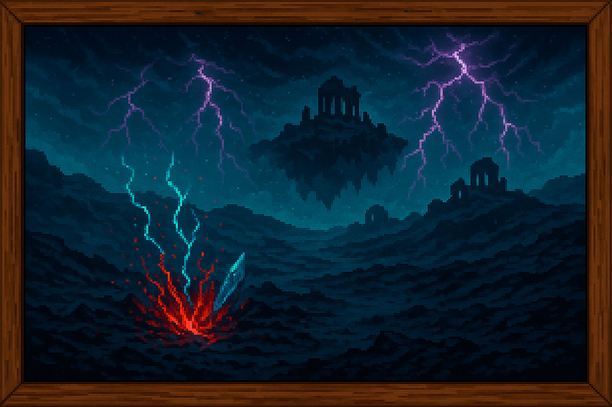

<section id="segunda-ruptura">
  <h3 style="
    border-left: 4px solid #f4511e;
    padding-left: 0.5em;
    color: #f4511e;
    font-size: 1.5em;
    margin-top: 1.5em;
  ">
    🩸 SEGUNDA RUPTURA
  </h3>
  
  
  <blockquote style="
    margin: 1em 0;
    padding: 0.75em 1em;
    background: hsl(0, 63.50%, 26.90%);
    border-left: 4px solid #f4511e;
    font-style: italic;
  ">
    La corrupción acumulada durante siglos desestabilizó por completo los Pozos, desatando energías primordiales que borraron reinos enteros y dejaron claro que la magia ya no podía ser controlada.
  </blockquote>
  

    
La Segunda Ruptura marcó el punto final de la Era Arcana.

    

      La corrupción acumulada a lo largo de siglos, alimentada por guerras, ambición y un uso desenfrenado de la Esencia arcana, terminó por desestabilizar completamente los Pozos de esencia. Con cada nuevo hechizo y cada intento de controlar el poder oscuro, los Cristales arcanos se debilitaban, sus estructuras vibraban y se fragmentaban desde dentro.
    

    
<strong>Finalmente, colapsaron.</strong>

    

      La segunda destrucción de los pozos fue mucho más devastadora que la primera. Las fuerzas liberadas eran antiguas y primordiales, y su desbordamiento borró del mapa reinos enteros. Magos poderosos, tanto los que luchaban por contener la corrupción como aquellos que la alimentaban, fueron consumidos. Ciudades enteras se derrumbaron, la tierra se abrió y los cielos se rasgaron: durante días no hubo luz ni orden.
    

    

      El mundo, herido de gravedad, despertó a una verdad inevitable: la magia ya no podía ser controlada. La humanidad, marcada por la catástrofe, comenzó a desconfiar profundamente de la Esencia arcana. Se prohibió su uso, se destruyeron grimorios, se cerraron academias y se persiguió a los pocos magos vivos.
    

    

      En paralelo, surgieron movimientos que promovían una alternativa más racional y controlada: la tecnología. Varios estados antimagia se unieron bajo una misma visión y, tras una guerra larga y cruel contra los últimos reductos mágicos, tomaron el control de todos los Pozos de esencia.
    

    

      Mediante la implantación de Sellos supresores extrajeron la Esencia arcana restante de los Cristales y los destruyeron por completo, dando fin a la Era mágica mientras los últimos restos de energía se dispersaban sin forma ni dirección.
    

    

      Para evitar que alguien concentrara siquiera una fracción de esa energía residual, se diseñaron los Disruptores mágicos: estructuras tecnológicas capaces de anular cualquier intento de manipulación de la Esencia arcana. Así comenzó la Era Industrial.
    

    

      Durante siglos esta nueva era prosperó bajo el amparo del hierro, el vapor y la lógica. La magia pasó a ser mito y superstición, una reliquia peligrosa del pasado. Sin embargo, la Esencia arcana nunca desapareció del todo: esparcida, fragmentada y olvidada… sí, pero con el tiempo volvió a susurrar. Algunos hallaron formas de usarla mínimamente, esquivando los Disruptores con runas primitivas y métodos antiguos, y así la historia volvió a ponerse en movimiento.
    

  

</section>
