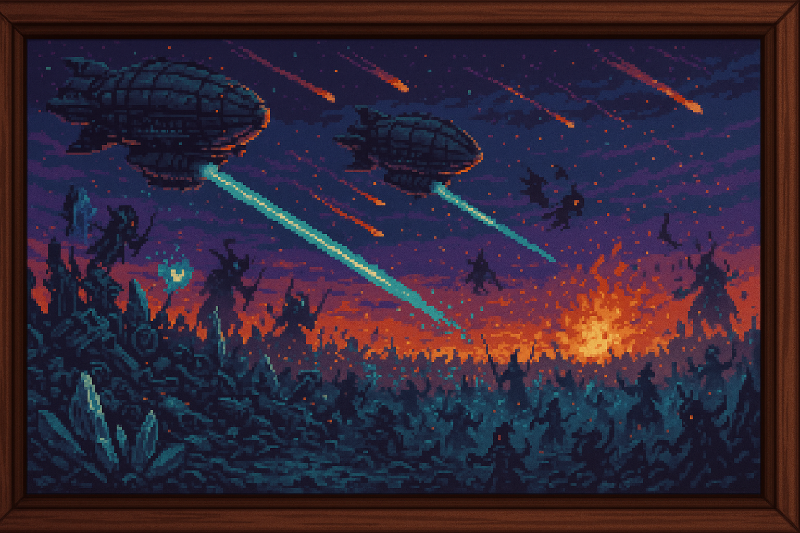

<section id="guerra-fragmentos">
  <h3 style="
    border-left: 4px solid #5e35b1;
    padding-left: 0.5em;
    color: #5e35b1;
    font-size: 1.5em;
    margin-top: 1.5em;
  ">
    ⚔️ LA GUERRA DE LOS FRAGMENTOS
  </h3>
  
  
  <blockquote style="
    margin: 1em 0;
    padding: 0.75em 1em;
    background: rgb(46, 32, 71);
    border-left: 4px solid #5e35b1;
    font-style: italic;
  ">
    Cuando la magia se volvió contra sí misma, los viejos conflictos estallaron y el mundo quedó atrapado entre la destrucción arcana y el avance implacable de la tecnología.
  </blockquote>
  

    <h4 style="color: #5e35b1; margin-top: 1.5em;">I. La Fractura de los Magos</h4>
    

      Tras la Segunda Ruptura, el mundo quedó devastado. La tierra se agrietaba, el cielo sangraba luz arcana y las aberraciones surgidas del desequilibrio se extendían como plagas. Mientras los pueblos luchaban por sobrevivir, los magos, lejos de unirse, se dividieron por completo.
    

    

      Algunos, siempre sedientos de poder, se aliaron con antiguas fuerzas oscuras, mientras otros, antaño virtuosos, cedieron a la ambición y la desesperación. Un tercer grupo resistía, decidido a restaurar el equilibrio, sellar pozos y reparar cristales, aunque su lucha parecía perdida entre las llamas de la traición.
    

    

      La guerra no comenzó contra la tecnología, sino dentro de la propia magia.
    

    <h4 style="color: #5e35b1; margin-top: 1.5em;">II. El Alzamiento del Progreso</h4>
    

      En el caos surgió una alianza inesperada: ciudades industriales, líderes políticos y antiguos sabios renunciaron a la magia y se unieron bajo un ideal claro: erradicar lo arcano.  
      Con disruptores mágicos y ejércitos de acero, avanzaron sin piedad contra todos los vestigios de la Esencia.
    

    

      Las tropas tecnológicas no distinguían matices: bibliotecas arcanas ardían, magos pacíficos eran ejecutados y cada Pozo conquistado recibía un Sello supresor.  
      Batallas épicas y masacres silenciosas marcaron el avance de una guerra sin compasión, marcando el final de la guerra <a href="../../Eventos/La_Batalla_Final_El_Asedio_del_Bastion_de_Nirthael/">con el Asedio del Bastión de Nirthael</a>.

    <h4 style="color: #5e35b1; margin-top: 1.5em;">III. El Silencio Sellado</h4>
    

      Con el tiempo, los últimos Pozos fueron sellados y los Cristales destruidos. Los magos restantes fueron capturados o ejecutados, y las regiones corruptas quedaron aisladas bajo cuarentenas eternas.
    

    

      Las antiguas torres cayeron y las academias fueron convertidas en templos de razón. Se reescribieron los libros de historia y se prohibió incluso mencionar a los grandes archimagos.  
      El mundo fue obligado a olvidar.
    

    

      Y pese a todo, la Esencia arcana nunca desaparece del todo…
    

  

</section>
