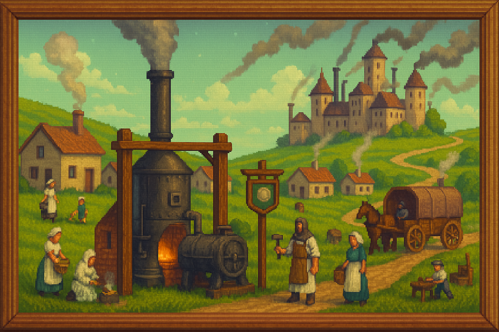

<!-- Era Industrial -->
<section id="era-industrial">
  <h2 style="border-left: 4px solid #66bb6a; padding-left: 0.5em; color: #2e7d32;">🛠 ERA INDUSTRIAL (Post-magia)</h2>
  
  
  <blockquote style="margin: 1em 0; padding: 0.75em 1em; background: #15311e; border-left: 4px solid #66bb6a; font-style: italic;">
    Bajo el eco de las forjas y el zumbido de las máquinas, el mundo renació al amparo de la tecnología, relegando la magia a mito y advertencia.
  </blockquote>
  

    <ul style="margin-top: 1em;">
      <li><strong>Implantación de los Sellos Supresores</strong> 
        Se desmantelan todos los Pozos activos. 
        Cristales son destruidos o almacenados en cámaras selladas.
      </li>
      <li><strong>Creación de Disruptores Mágicos Permanentes</strong> 
        Se dispersan por todo el continente para impedir cualquier concentración mágica.
      </li>
      <li><strong>Gran Caza de Magos</strong> 
        Los pocos practicantes que sobreviven son perseguidos, ejecutados o forzados al exilio.
      </li>
      <li><strong>Prohibición del Saber Arcano</strong> 
        Se reescriben los libros de historia. 
        La existencia de la magia se reduce a superstición peligrosa. 
        El nombre de muchas ciudades mágicas es eliminado de los mapas.
      </li>
      <li><strong>Redescubrimiento Tardío de la Esencia</strong> 
        Siglos después, se detecta que la Esencia arcana, aunque dispersa, sigue existiendo. 
        Algunos comienzan a usarla en secreto. 
        Se crean runas primitivas que esquivan los Disruptores.
      </li>
    </ul>
  

</section>