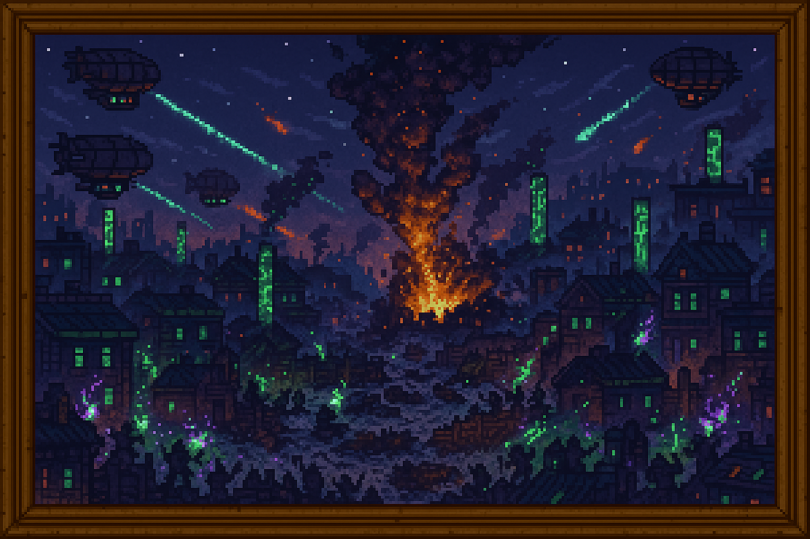

<!-- Revolución Arcana -->
<section id="revolucion-arcana">

  <h2 style="border-left: 4px solid #66bb6a; padding-left: 0.5em; color: #8e24aa;">🔥 <strong>La Revolución Arcana</strong></h2>
  
  <blockquote style="margin: 1em 0; padding: 0.75em 1em; background: #2e033c; border-left: 4px solid #8e24aa; font-style: italic;">
    La magia renace entre las ruinas de la opresión.
  </blockquote>
  

    
Tras el descubrimiento del <strong>Testamento de Roenhal</strong>, pueblos y ciudades que siglos atrás habían basado su identidad en la magia, y cuyas costumbres y tradiciones mágicas fueron brutalmente reprimidas por la <strong>Coalición Tecnológica</strong>, encontraron en el conocimiento recuperado una oportunidad única. La posibilidad de volver a emplear la <strong>Esencia arcana</strong>, aunque fuese débil y fragmentada, supuso un resurgimiento cultural y una esperanza largamente reprimida.

    
Lo que comenzó como pequeños movimientos culturales, <strong>manifestaciones</strong> y protestas aisladas en territorios mágicos pronto escaló en intensidad. Los reclamos iniciales, pacíficos y limitados, dieron paso a pequeños actos de insurgencia que se multiplicaron rápidamente. La <strong>Coalición</strong> respondió reforzando la vigilancia y desplegando fuerzas militares para mantener el orden, aumentando aún más las tensiones en todo el continente.

    
El punto de ruptura llegó en la histórica ciudad de <strong>Rohlan</strong>, una antigua capital arcana que había sido reconstruida con arquitectura industrial para borrar su pasado mágico. Allí, durante una manifestación especialmente masiva y agitada, un enfrentamiento desencadenó una rebelión violenta. Durante tres días, Rohlan se sumergió en un caos absoluto; insurgentes armados con magia rudimentaria y tropas de la Coalición se enfrentaron en combates callejeros encarnizados. El resultado fue una masacre catastrófica, con pérdidas altísimas en ambos bandos y daños irreparables en la infraestructura urbana.

    
Ante la amenaza real de que este conflicto escalara hasta convertirse en una nueva guerra devastadora, altos mandos de ambos bandos decidieron buscar una solución inmediata. Fuera de los canales oficiales y estructuras militares, se convocó una <strong>reunión extraordinaria</strong> en territorio neutral. Allí se dieron cita los ancianos archimagos más respetados y varios veteranos tecnócratas influyentes, conformando un grupo mixto que representaba ambas visiones del mundo.

    
Durante días, este grupo debatió y negoció sin descanso. Finalmente, redactaron el histórico <strong>Pacto de Rohlan</strong>, un documento que proponía la independencia de todas aquellas ciudades y regiones cuyo arraigo mágico era innegable y cuya identidad chocaba inevitablemente con la Coalición. Este acuerdo fue aceptado por ambos bandos con reticencia pero también con alivio, conscientes del riesgo que implicaba prolongar el conflicto.

    
No obstante, este pacto no fue bien recibido por todos. En particular, uno de los científicos más brillantes de la Coalición, el renombrado ingeniero <strong>Viktor Hesse</strong>, lo consideró una traición absoluta a los principios racionales y tecnológicos que sostenían su sociedad. En desacuerdo absoluto con sus líderes, reunió a un grupo considerable de seguidores que compartían sus ideales y abandonó públicamente la Coalición, partiendo hacia el exilio voluntario en una región desconocida del continente.

  

</section>
