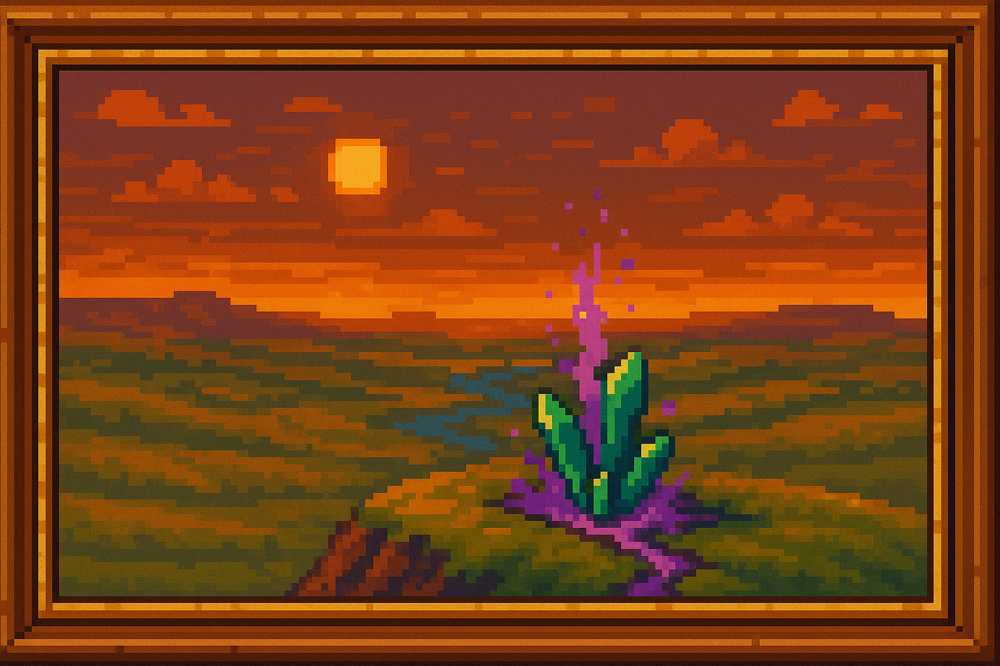

<!-- eras.md -->

<!-- Introducción -->

  En esta página encontrarás las tres grandes eras que han marcado la historia de Pepeland.  
  Cada sección incluye sus etapas y eventos más relevantes.

  

<!-- Índice pequeño -->
<ul style="list-style: none; padding: 0; margin-bottom: 2em;">
  <li><a href="#era-dormida" style="text-decoration: none; font-weight: bold;">🪨 Era Dormida (Pre-magia)</a>     <a href="/docs/Lore/1. Era Dormida/ERA DORMIDA.md">+info</a></li>
  <li><a href="#era-arcana" style="text-decoration: none; font-weight: bold;">🔮 Era Arcana</a></li>
  <li><a href="#era-industrial" style="text-decoration: none; font-weight: bold;">🛠 Era Industrial (Post-magia)</a></li>
</ul>

<!-- Era Dormida como card colapsable -->

  

     🪨 ERA DORMIDA (Pre-magia)
  

  <blockquote style="margin: 1em; padding: 0.75em 1em; background:rgb(57, 64, 66); border-left: 4px solid #78909c; font-style: italic;">
    En la quietud de la tierra yacía una fuerza latente; la Esencia dormida esperaba su despertar, mientras la humanidad ignoraba por completo su existencia.
  </blockquote>
  

    <ul style="margin-top: 1em;">
      <li><strong>Ignorancia Arcana</strong> 
        La humanidad vive siglos sin saber de la existencia de la Esencia arcana. 
        La vida gira en torno a los elementos físicos, sin presencia de magia.
      </li>
      <li><strong>La Expedición de Kor-Balun</strong> 
        Mineros en busca de diamantes descubren, por accidente, el primer Pozo de esencia, con Cristales arcanos malformados.
      </li>
      <li><strong>La Liberación Inesperada</strong> 
        Al fragmentar un cristal, se libera una onda de Esencia arcana pura que recorre cuevas y aflora en la superficie del mundo.
      </li>
      <li><strong>La Maldición de los Primeros</strong> 
        Los miembros de la expedición quedan atrapados en un vacío espectral. 
        Desde entonces, todo aquel que desciende al Pozo desaparece.
      </li>
    </ul>
  

<!-- Era Arcana como card colapsable -->

  

             🔮 ERA ARCANA
  

  <blockquote style="margin: 1em 1.5em; padding: 0.75em 1em; background:rgb(141, 93, 16); border-left: 4px solid #ff7043; font-style: italic;">
    La chispa de la magia iluminó el mundo, desatando esplendor y contradicción; imperios se alzaron en su nombre y corazones se corrompieron con su poder.
  </blockquote>
  

    
Una era de esplendor, conflicto y decadencia mágica. Se divide en cuatro etapas clave:

    <!-- 1. El Despertar y la Expansión -->
    <h3 style="margin-top: 1.5em; color: #bf360c;">🟣 1. El Despertar y la Expansión</h3>
    <ul>
      <li><strong>Aparición de los Pozos de Esencia</strong> 
        Surgen por todo el mundo, liberando magia usable a través de Cristales arcanos.
      </li>
      <li><strong>El Auge de los Idealistas</strong> 
        Sociedades comienzan a moldear el mundo con Esencia arcana. 
        Se fundan academias, clanes mágicos y ciudades encantadas.
      </li>
      <li><strong>La Disparidad Mágica</strong> 
        No todos pueden usar magia; surgen desigualdades entre quienes canalizan mucha esencia y quienes apenas la perciben.
      </li>
      <li><strong>La Corrupción Silenciosa</strong> 
        Algunos magos comienzan a abusar del poder. 
        Cristales se oscurecen, aparecen grietas brillantes y señales de inestabilidad.
      </li>
    </ul>

    <!-- 2. La Primera Ruptura -->
    <h3 style="margin-top: 1.5em; color: #e64a19;">💥 2. La Primera Ruptura</h3>
    <ul>
      <li><strong>Fragmentación Forzada</strong> 
        Cristales corrompidos estallan al ser sobreutilizados, liberando Esencia arcana pura e inutilizable.
      </li>
      <li><strong>Consecuencias Mundiales</strong> 
        El mundo cambia drásticamente:
        <ul style="list-style: disc; margin-left: 1.5em;">
          <li>Noches prolongadas</li>
          <li>Plagas destructivas</li>
          <li>Aparición de monstruos desconocidos</li>
          <li>División de los Magos:
            <ul style="list-style: circle; margin-left: 1em;">
              <li>Protectores: intentan restaurar el equilibrio.</li>
              <li>Corruptos: desean dominar la esencia salvaje.</li>
              <li>Caídos: antes nobles, ahora rendidos al poder oscuro.</li>
            </ul>
          </li>
        </ul>
      </li>
      <li><strong>Conflicto entre Magos</strong> 
        Inician guerras internas entre las tres facciones.
      </li>
      <li><strong>Batalla de Valencruz</strong> 
        Los protectores derrotan a un grupo de corruptos, pero deben sellar el lugar con sus vidas.
      </li>
    </ul>

    <!-- 3. La Segunda Ruptura -->
    <h3 style="margin-top: 1.5em; color: #f4511e;">🩸 3. La Segunda Ruptura</h3>
    <ul>
      <li><strong>Uso descontrolado y corrupción total</strong> 
        A pesar de los intentos de restaurar el equilibrio, los magos corruptos y los poderes oscuros sobrecargan muchos Pozos de esencia.
      </li>
      <li><strong>Colapso de Cristales Arcanos</strong> 
        Las redes mágicas del mundo se saturan. Cristales centrales se sobrecargan y revientan, provocando ondas de destrucción masiva:
        <ul style="list-style: disc; margin-left: 1.5em;">
          <li>Devastación global</li>
          <li>Reinos enteros colapsan</li>
          <li>Ciudades flotantes caen</li>
          <li>La tierra se fragmenta en zonas inhóspitas</li>
        </ul>
      </li>
      <li><strong>Aceleración del odio hacia la magia</strong> 
        Las masas, testigos del horror, comienzan a rechazar toda forma de magia. Incluso los magos benévolos son considerados amenazas.
      </li>
      <li><strong>Fundación oculta de Nirthael</strong> 
        Los magos corruptos más poderosos inician en secreto la construcción de una fortaleza flotante como plan de huida: Nirthael.
      </li>
    </ul>

    <!-- 4. La Guerra de los Fragmentos -->
    <h3 style="margin-top: 1.5em; color: #ef6c00;">⚔️ 4. La Guerra de los Fragmentos</h3>
    <ul>
      <li><strong>Alzamiento Tecnológico</strong> 
        Estados industriales y pueblos antimagia comienzan a organizarse. 
        Nace la Coalición tecnológica.
      </li>
      <li><strong>Inicio de la Guerra Mágico-Tecnológica</strong> 
        La coalición ataca con Disruptores mágicos y tecnología avanzada. 
        Los magos están divididos y debilitados.
      </li>
      <li><strong>Eventos clave del conflicto</strong> 
        <ul style="list-style: disc; margin-left: 1.5em;">
          <li>El Asedio de Láridel: ciudad mágica defensiva, destruida tras meses de resistencia.</li>
          <li>La Rebelión de Valencruz (cruce con etapa anterior).</li>
          <li>El Levantamiento de Arzkar: primera gran victoria tecnológica.</li>
          <li>El Incendio de Roenhal: destrucción del mayor archivo de conocimiento arcano.</li>
          <li>El Duelo de Elion y Kaetra: choque final entre mentor y alumna en ciudad flotante.</li>
          <li>El Colapso del Valle de Nhereth: intento fallido de manipular esencia mutada.</li>
        </ul>
      </li>
      <li><strong>Batalla Final Oficial: El Asedio del Bastión de Nirthael</strong> 
        ltimos magos corruptos intentan huir del continente en una fortaleza voladora. 
        La coalición lanza una ofensiva terrestre, aérea y de abordaje. 
        Nirthael es destruida y se sella el conflicto armado.
      </li>
      <li><strong>Batalla Final Extraoficial: La Masacre de Velanthar</strong> 
        ltima ciudad mágica no militar, hogar de refugiados de todo tipo. 
        Es rodeada y destruida sin resistencia. 
        Representa la muerte simbólica de la cultura mágica.
      </li>
    </ul>
  

<!-- Era Industrial como card colapsable -->

  

     🛠 ERA INDUSTRIAL (Post-magia)
  

  <blockquote style="margin: 1em; padding: 0.75em 1em; background:rgb(30, 78, 46); border-left: 4px solid #66bb6a; font-style: italic;">
    Bajo el eco de las forjas y el zumbido de las máquinas, el mundo renació al amparo de la tecnología, relegando la magia a mito y advertencia.
  </blockquote>
  

    <ul style="margin-top: 1em;">
      <li><strong>Implantación de los Sellos Supresores</strong> 
        Se desmantelan todos los Pozos activos. 
        Cristales son destruidos o almacenados en cámaras selladas.
      </li>
      <li><strong>Creación de Disruptores Mágicos Permanentes</strong> 
        Se dispersan por todo el continente para impedir cualquier concentración mágica.
      </li>
      <li><strong>Gran Caza de Magos</strong> 
        Los pocos practicantes que sobreviven son perseguidos, ejecutados o forzados al exilio.
      </li>
      <li><strong>Prohibición del Saber Arcano</strong> 
        Se reescriben los libros de historia. 
        La existencia de la magia se reduce a superstición peligrosa. 
        El nombre de muchas ciudades mágicas es eliminado de los mapas.
      </li>
      <li><strong>Redescubrimiento Tardío de la Esencia</strong> 
        Siglos después, se detecta que la Esencia arcana, aunque dispersa, sigue existiendo. 
        Algunos comienzan a usarla en secreto. 
        Se crean runas primitivas que esquivan los Disruptores.
      </li>
    </ul>
  

