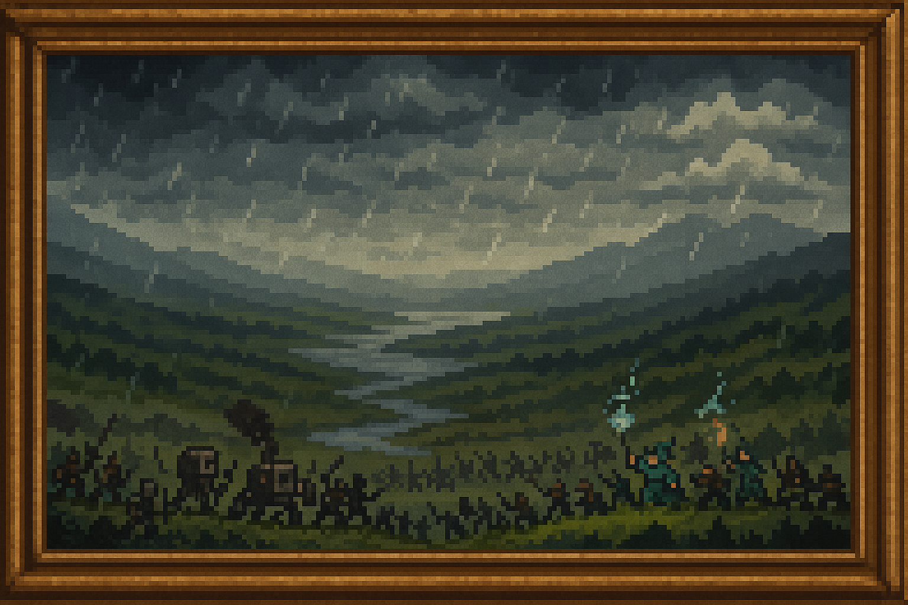

<header>
    <h1>📅 Eventos por Eras</h1>
  </header>
  <section style="text-align: center;">
    
  </section>
  
  

    

      <a href="../../cronologia" class="md-button md-button--primary">
      Cronología Completa
      </a>
      <a href="../../batallas" class="md-button md-button--primary">
      Batallas
      </a>      <a href="../../../Personajes Historicos/Main Personajes" class="md-button md-button--primary">
      Personajes Historicos
      </a>
    

  

  <nav>
    <h2></h2>
  </nav>
  <main>
    <section>
      <h2>🗡️ Batallas</h2>
      <ul>
        <li><a href="../El_Incendio_de_Roenhal">El Incendio de Roenhal</a></li>
        <li><a href="../El_Colapso_del_Valle_de_Nhereth">El Colapso del Valle de Nhereth</a></li>
        <li><a href="../El_Asedio_de_Laridel">El Asedio de Láridel</a></li>
        <li><a href="../La_Rebelion_de_Valencruz">La Rebelión de Valencruz</a></li>
        <li><a href="../La_Emboscada_del_Paso_de_Kaenmor">La Emboscada del Paso de Kaenmor</a></li>
        <li><a href="../El_Levantamiento_de_Arzkar">El Levantamiento de Arzkar</a></li>
        <li><a href="../El_Duelo_de_Elion_y_Kaetra">El Duelo de Elion y Kaetra</a></li>
        <li><a href="../La_Noche_de_los_Ca%C3%ADdos_en_Avarenn">La Noche de los Caídos en Avarenn</a></li>
        <li><a href="../La_Infiltracion_en_el_Bastion_de_Dravend">La Infiltración en el Bastión de Dravend</a></li>
        <li><a href="../La_Liberacion_de_Tenebrax">La Liberación de Tenebrax</a></li>
        <li><a href="../La_Batalla_Final_El_Asedio_del_Bastion_de_Nirthael">La Batalla Final – El Asedio del Bastión de Nirthael</a></li>
        <li><a href="../La_Masacre_de_Velanthar">La Masacre de Velanthar</a></li>
      </ul>
    </section>
    <section>
      <h2>📜 Eventos Históricos</h2>
      <ul>
        <li><a href="../../Pepeland_1">Pepeland I – Crónica</a></li>
        <li><a href="../../Pepeland_2">Pepeland II – Crónica</a></li>
      </ul>
    </section>
  </main>