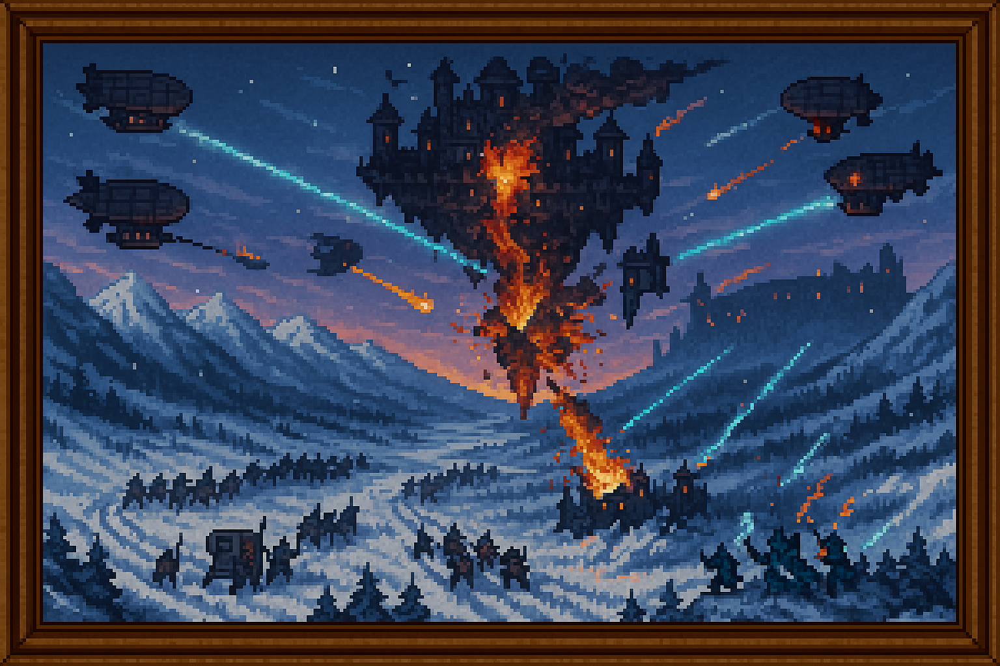

<!-- Nuevo formato de título como banner estilizado -->ElAsediodeNirthael

  <h2 style="
    margin: 0;
    color: #03dac6;
    font-weight: bold;
    text-align: center;
    font-size: 2em;
  ">
    ⚔️ La Batalla Final – El Asedio del Bastión de Nirthael
  </h2>

  

  

    Defensor: Coalición tecnológica
  

  

    Atacante: Magos corrompidos
  

  Resultado: Victoria tecnológica

  <strong>Ⅰ. Fase Terrestre – El Cierre del Anillo</strong>  

  Unidades mecanizadas comenzaron a moverse desde tres frentes, avanzando a través de pasos nevados y senderos olvidados para rodear completamente la base del sistema de anclaje de Nirthael. La fortaleza estaba suspendida a baja altura en ese momento, todavía conectada por columnas de soporte que canalizaban Esencia desde la tierra para alimentar los motores arcanos.

  La primera oleada tuvo como objetivo cortar esas conexiones. Los magos corruptos, apostados en las torres inferiores, lanzaron hechizos de contención y fuego, pero fueron superados por el número, precisión y disciplina de las tropas tecnológicas. A medida que los anclajes caían uno por uno, la estructura empezó a elevarse de forma forzada, sin estabilización adecuada.

  El despegue de Nirthael se adelantó por necesidad. No estaba lista.

  <strong>Ⅱ. Fase Aérea – El Bombardeo sobre el Bastión</strong>  

  Una vez en el aire, Nirthael quedó expuesta.

  Desde el este, una flota de dirigibles acorazados y transportes ligeros de combate alcanzó la altitud del bastión. Equipados con Disruptores de rango extendido, comenzaron un bombardeo sistemático sobre las secciones exteriores de la fortaleza: torres de defensa, puntos de recarga mágica, y depósitos de suministro.

  Los magos corrompidos respondieron con fuerza. Artillería mágica, relámpagos concentrados, enjambres de proyectiles arcanos. Durante horas, el cielo fue una tempestad de fuego cruzado. Las pérdidas se acumulaban en ambos bandos.

  En mitad del combate, uno de los cristales de soporte principal de Nirthael fue alcanzado por un impacto directo. Su núcleo estalló, y con él cayó una sección entera del bastión. Lo que antes era una plataforma de escape, comenzó a parecer una tumba aérea.

  <strong>Ⅲ. El Asalto – La Caída de la Fortaleza</strong>  

  Con los escudos debilitados y la plataforma inestable, la coalición dio la orden: abordaje.

  Grupos de asalto aerotransportados descendieron sobre la fortaleza con armaduras ligeras, lanzacables y cargas de disrupción. El combate cuerpo a cuerpo estalló en las cubiertas fracturadas de Nirthael. Los magos, atrincherados, usaban lo último de su poder para intentar ganar tiempo. Muchos sabían que no escaparían, pero luchaban por proteger a los altos mandos que aún intentaban activar los sistemas de navegación de emergencia.

  No lo consiguieron.

  Cuando la zona de mando fue tomada, uno de los ingenieros arcanos activó una sobrecarga defensiva como último recurso. El estallido alcanzó varios niveles internos, dejando a Nirthael completamente descompensada. En los minutos siguientes, la estructura comenzó a descender.
  
  Algunos la abandonaron en cápsulas suspendidas por levitación residual. Otros saltaron y murieron. Los pocos que sobrevivieron fueron capturados o ejecutados. Nadie huyó del continente.

  <strong>Ⅳ. El Final del Vuelo</strong>  

  Nirthael impactó contra las montañas de Khorhal al amanecer. La explosión generó una onda mágica que desactivó disruptores en kilómetros a la redonda durante breves segundos. Pero no quedaba nadie a quien ayudar. El bastión fue enterrado entre rocas, fuego y silencio.

  Ese día marcó el fin de la Guerra de los Fragmentos.

*Registrado por el cronista Aurelion.*  
