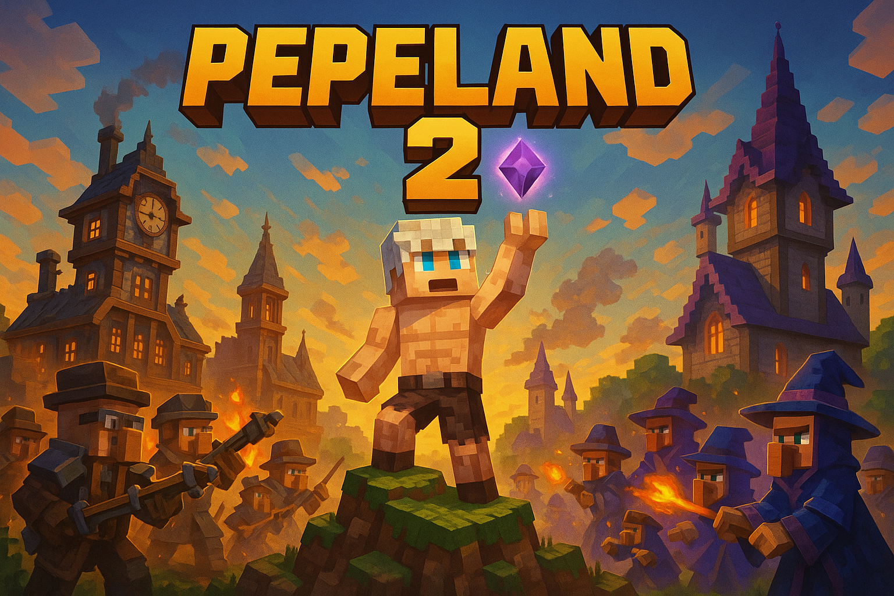
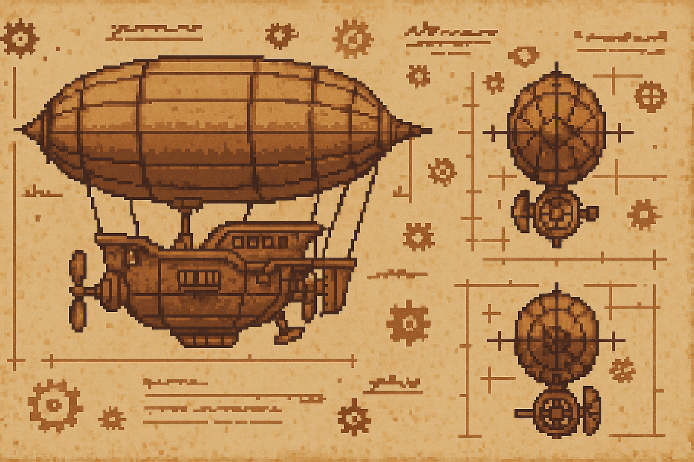
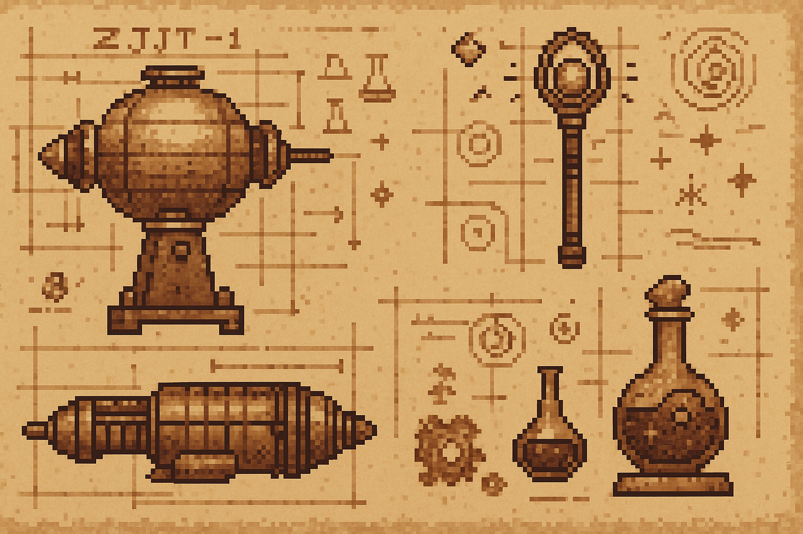
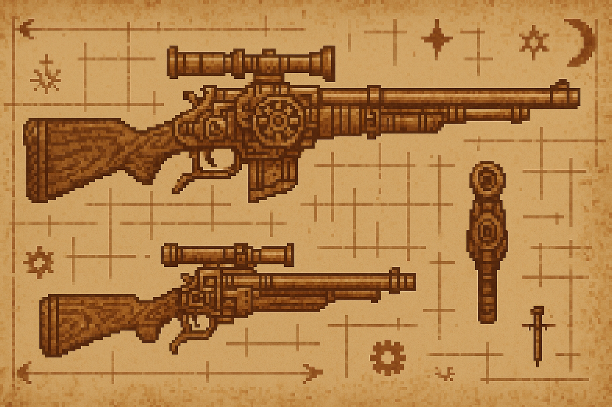
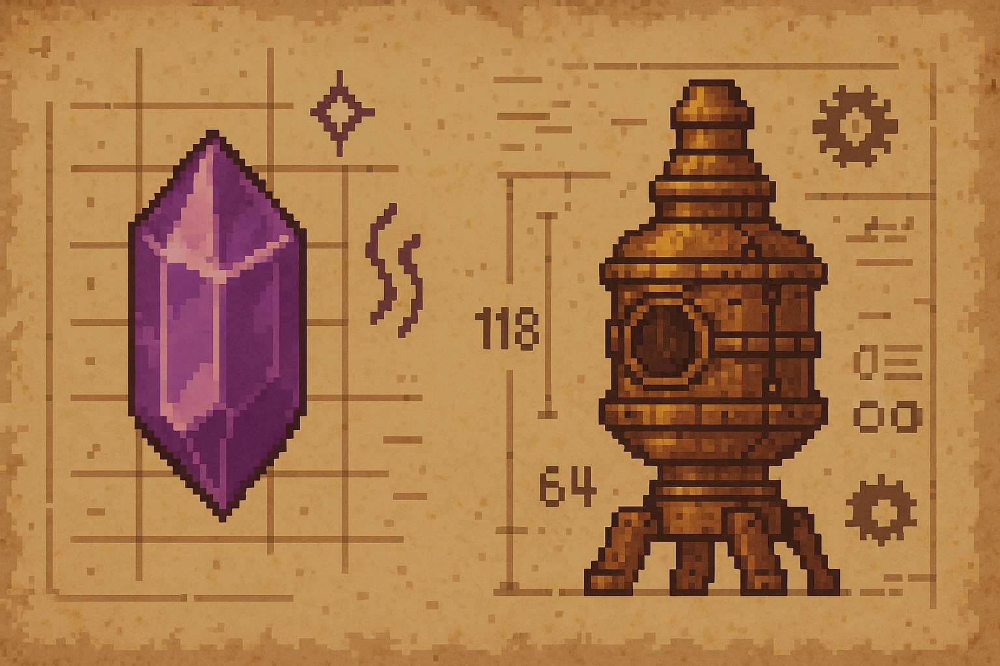

# ✨ Bienvenido a **Pepeland Wiki**

> Aquí se narra el paso del tiempo, el ascenso de los magos, la caída de los cristales... y el renacer de una guerra mágica que lo cambiará todo.

  

---

## 🗺️ ¿Qué pasó en **Pepeland 1**?

  <strong>Resumen Pepeland 1</strong> 
  Después de la <em>Era Dormida</em>, los cristales fueron sellados por los Arcanos para contener el poder 
  destructivo. El mundo quedó en aparente calma… hasta la llegada del nuevo ciclo mágico. 
      
    
<a href="Lore/Pepeland_1">+ Info</a>

---

## 📚 Explora el **Lore**

  

    <h3>🌀 Era Dormida</h3>
    <a href="Lore/1.%20Era%20Dormida/ERA%20DORMIDA">Leer más →</a>
  

  

    <h3>🌟 Era Arcana</h3>
    <a href="Lore/2.%20Era%20Arcana/1._El_Despertar_y_la_Expansion">Leer más →</a>
  

  

    <h3>⚙️ Era Industrial</h3>
    <a href="Lore/3.%20Era%20Industrial/ERA%20INDUSTRIAL">Leer más →</a>
  

  
¿Mucho texto? Lee el resumen rápido:

  <a class="cta-button" href="Lore/Resumen">Leer resumen →</a>

  <strong>¿Sabías que…?</strong> 
  La energía arcana residual aún fluye en zonas olvidadas, potenciando reliquias.

---

## 🛡️ Facciones Destacadas

  

    <h3>🔮 Magos</h3>
    
Guardianes de la esencia y herederos de los grimorios de Rohlan.

  

  

    <h3>⚔️ Coalición</h3>
    
Ingenieros visionarios que fusionan ciencia y magia en sus golems.

  

  

    <h3>🤖 Ocultos</h3>
    
Tan solo corren rumores oscuros, nadie los ha visto pero todo saben de su existencia.

  

---

## 🔧 Avances Tecnológicos

  <figure>
    
    <figcaption>Primer Prototipo de Zeppelin.</figcaption>
  </figure>
  <figure>
    
    <figcaption>Artilugios varios magicos.</figcaption>
  </figure>
  <figure>
    
    <figcaption>Planos de armas de fuego.</figcaption>
  </figure>
  <figure>
    
    <figcaption>Planos avanzados de ingeniería arcano-tecnológica.</figcaption>
  </figure>

  <strong>¡Cuidado!</strong> 
  Usar magia sin estabilizador puede generar rupturas dimensionales.

---

## ✨ Magia y Coalición

<ul class="feature-list">
  <li>🔮 <strong>Magia</strong> — Volvió con el testamento de Rohlan; ahora los Arcanos reabren sus bibliotecas.</li>
  <li>🤝 <strong>Coalición</strong> — Lidera la reconstrucción conjunta de fortalezas y fábricas, equilibrando poder y progreso.</li>
</ul>
