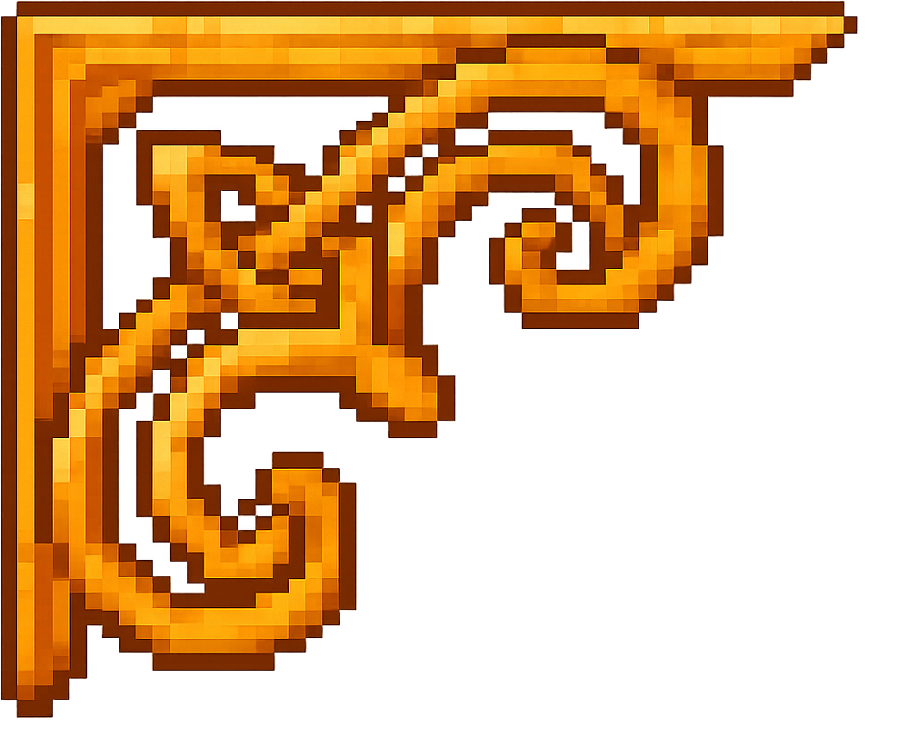
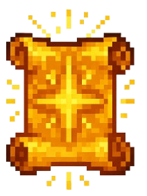
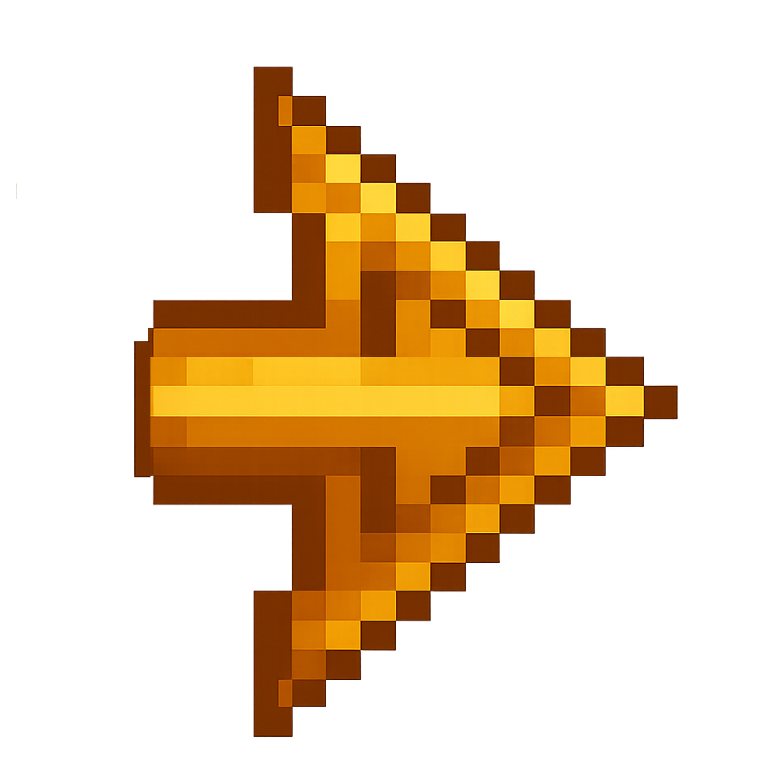
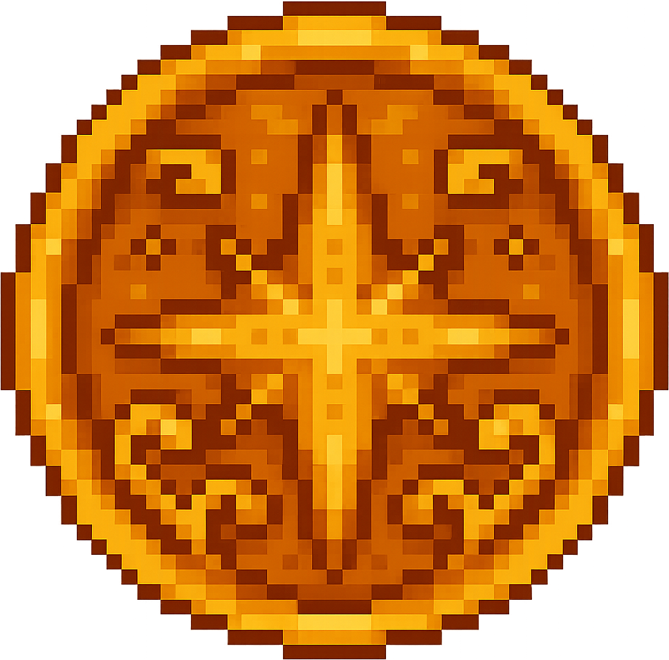
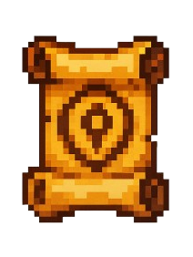
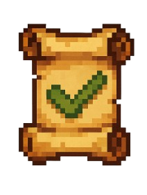

#Misiones

  <h2>Facción: <em>Nombre de la Facción</em></h2>

  <!-- PRINCIPALES -->
  

    <!-- esquinas... -->
    
    
    
    

    <!-- checkbox + label con ID único -->
    <input type="checkbox" id="m-principales-1" class="mission-toggle" checked>
    <label for="m-principales-1" class="mission-label">
      
      Principales
      
    </label>

    

      <!-- tu contenido -->
      <!-- Bloque de misión -->         

  

    
    Título de la Misión
  

  

    Aquí va la breve descripción de la misión. Explica en una frase el objetivo principal.
      <a href="../main/coalicion/Cmainquest1" class="more-details">Mas detalles</a>
  

      

    

    

  

  <!-- SECUNDARIAS -->
  

    <!-- esquinas... -->
    
    
    
    

    <!-- ¡ID distinto aquí! -->
    <input type="checkbox" id="m-secundarias-1" class="mission-toggle">
    <label for="m-secundarias-1" class="mission-label">
      
      Secundarias
      
    </label>

    

      <!-- tu contenido -->

  

    
    Título de la Misión
  

  

    Aquí va la breve descripción de la misión. Explica en una frase el objetivo principal.
  

      
    

  

  

    <!-- esquinas... -->
    
    
    
    

    <!-- ¡ID distinto aquí! -->
    <input type="checkbox" id="m-completadas-1" class="mission-toggle">
    <label for="m-completadas-1" class="mission-label">
      
      Completadas
      
    </label>

      <!-- tu contenido -->

  

    
    Título de la Misión
  

    

  

  <!-- Repite cambiando sólo el sufijo numérico -->

