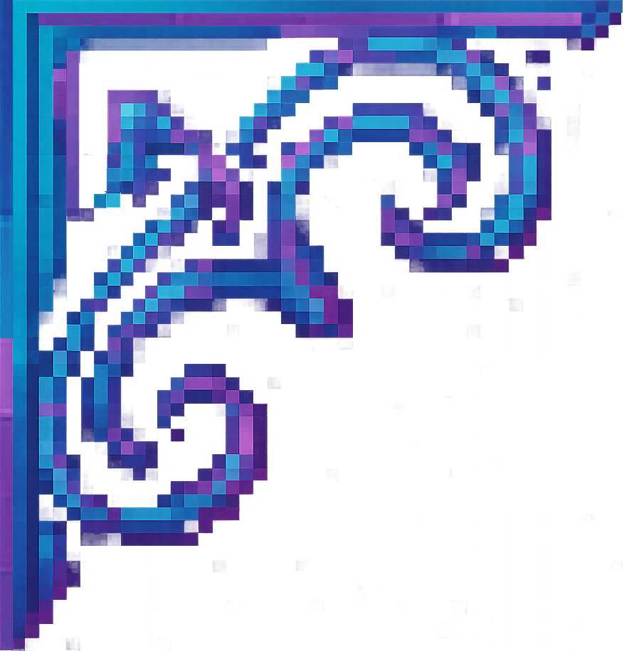

#

    <!-- esquinas... -->
    
    
    
    
         

  

    Título de la Misión
  

  
    <!-- DETALLE DE MISIÓN -->
  

    <!-- Objetivo -->
    

      Objetivo: Recuperar la reliquia ancestral del templo.
    

    <!-- Descripción ampliada -->
    

      Tras infiltrarte en las ruinas, deberás sortear trampas y derrotar a los guardianes para hacerte con la reliquia antes de que el culto la invoque.
    

  

    <input type="checkbox" id="reward-toggle" class="action-toggle1">
    <label for="reward-toggle" class="detail-header1 magia reward1">Recompensa</label>
    

      Aquí recibirás:
      <ul class="reward-list">
        <li>500 monedas</li>
        <li>Poción de salud</li>
        <li>Espada mejorada</li>
      </ul>
    

  

  

    <input type="checkbox" id="ubi-toggle" class="action-toggle1">
    <label for="ubi-toggle" class="detail-header1 magia ubi1">Ubicación</label>
    

      
<strong>Coordenadas:</strong>  X:123, Y:456

      
Claro del Bosque Sombrío, busca la estatua antigua.

    

  

    <a href="../../../MagiaMisiones" class="more-details">Volver atras</a>

